<!-- _class: title -->

# nvbench-compare
## Robust benchmark comparison from summaries and samples

Oleksandr Pavlyk / July 15, 2026

---

# What This Talk Covers

  - why `nvbench-compare ref.json cmp.json` moved beyond a single mean/stdev rule;
  - how the new decision tree works;
  - how developers should interpret the output.

<span class="xsmall">Ref: https://github.com/NVIDIA/nvbench/pull/386, adds `docs/nvbench_compare.md`</span>

---

# Why This Work Exists

<div class="callout">

Reduce the noise/signal ratio in performance CI and local analysis.

</div>

<div class="small" style="margin-top: 1.2em;">

When evidence is weak, comparison should say undecided (`AMBG`) and explain why.

</div>

<!--
Examples to show:

- repeated timing values with low apparent robust noise;
- overlapping runs where component weights shift;
- clear timing gap caused by clock-rate change;
- missing or unusable summaries.
-->

---

# Same Benchmark, Different Verdicts

Issue [#316](https://github.com/NVIDIA/nvbench/issues/316) captured a concrete failure mode:

- same benchmark executable (`cub.bench.radix_sort.keys.base`);
- no SASS change;
- two independent runs on the same exclusive use workstation;
- 168 matched rows;
- legacy mean/stdev comparison reported **24 FAST/SLOW** rows
- remaining 144 rows reported **SAME**

---

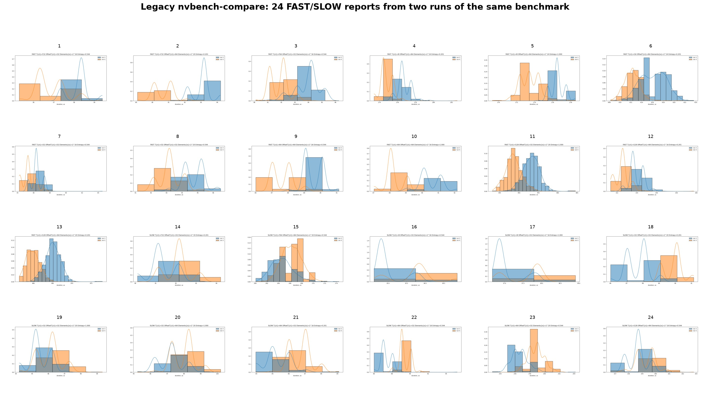

<span class="xsmall">Source: [NVIDIA/nvbench#316](https://github.com/NVIDIA/nvbench/issues/316), issue comment [4397673268](https://github.com/NVIDIA/nvbench/issues/316#issuecomment-4397673268).</span>

---

# Getting Benchmark Data

NVBench-instrumented benchmarks can emit results as JSON data, optionally with binary sidecar files:

<div class="light-code">

```text
./benchmark ... --json result.json
./benchmark ... --jsonbin result.json
```

</div>

| Option | Output | What compare can use |
|---|---|---|
| `--json result.json` | one JSON file | device metadata, benchmark states, execution summaries |
| `--jsonbin result.json` | JSON file + binary sidecar files | 👆 + raw timing/frequency samples |

---

# JSON Summary Tags

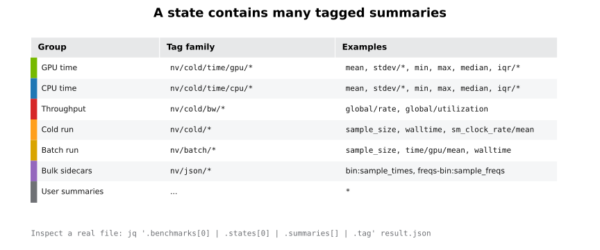

---

# Legacy Rule

The legacy comparison is intentionally simple:

<div class="light-code">

```text
center := mean
noise  := stdev / mean
%Diff  := (cmp_center - ref_center)/ref_center
```

```text
SAME   if abs(%Diff) <= min(ref_noise, cmp_noise)
FAST   if not SAME and compare center is lower
SLOW   if not SAME and compare center is higher
????   if timing/noise cannot be evaluated
```

</div>

The rule is reference-relative, so swapping inputs is not purely symmetric.

---

# New Mental Model

Treat performance data as a timing interval over which measured timings varied.

This is intuition, not a formal probability model:

- center: representative timing;
- interval: plausible timing range from summaries or samples;
- bulk data: extra evidence when samples are available.

---

<!-- _footer: "" -->

# Interval Geometry

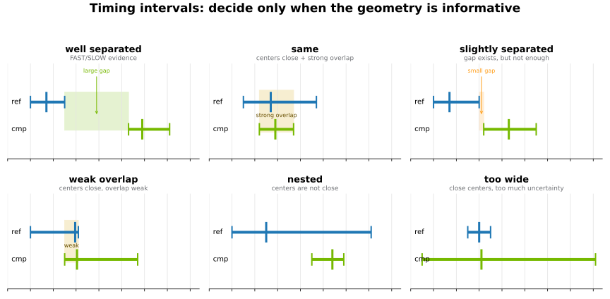

---

# Robust Timing Summaries

NVBench already reported `min`/`max` and `mean`/`stdev`.
The new robust summaries are based on *quartiles*:

<div class="light-code">

```text
q1, median, q3
iqr/absolute = q3 - q1
iqr/relative = (q3 - q1) / median
```

</div>

- `median` is a measure of *location* (like `mean`) but less sensitive to outliers;
- inter-quartile range (IQR) is a measure of *dispersion* (like `stdev`)

<span class="xsmall">[NVIDIA/nvbench#379](https://github.com/NVIDIA/nvbench/pull/379): Introduce robust metrics</span>

---

# More About Robust Metrics

- robust summaries are hidden;
- `mean`/`stdev` summaries stay displayed in markdown summary tables;
- `q1`/`median`/`q3` combine with existing `min`/`max` summaries to build intervals;
- robust summaries are reported by
  - `measure_cold` for CPU- & GPU- times;
  - `measure_cpu_only` for CPU times.

---

# Constructing Centers and Intervals

`nvbench-compare` chooses the same timing family for both sides of a comparison:

| Available data | Center | Interval |
|---|---:|---|
| Robust summaries | median | `[min, q3]` |
| Bulk samples | median recomputed from samples | `[min, q3]` |
| Legacy summaries | mean | `mean ± stdev`, clipped if `min`/`max` present |

If only one side has robust summaries, bulk samples may fill the gap. Otherwise
the comparison falls back consistently to legacy `mean`/`stdev` intervals.

---

<!-- _footer: "" -->

# Why `[min, q3]`?

Timing data often has a slow outliers.

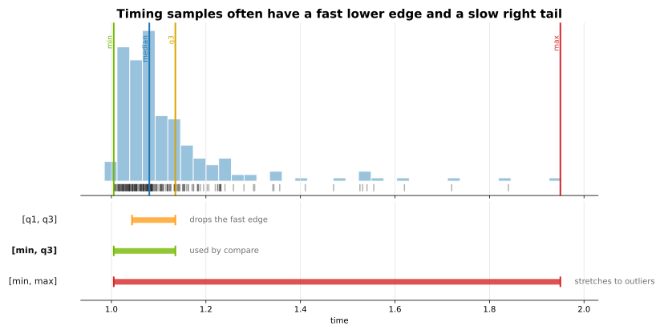

`[min, q3]` keeps the attainable fast runs while limiting the influence of slow
outliers. <!-- It is intentionally more conservative than `[q1, q3]` and less
outlier-sensitive than `[min, max]`. -->

---

# Timing and Frequency Move Together

<div class="columns">

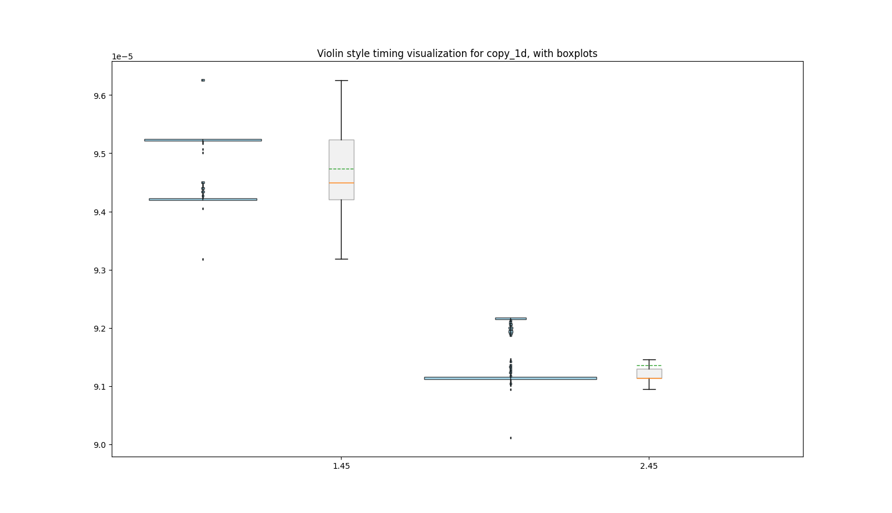

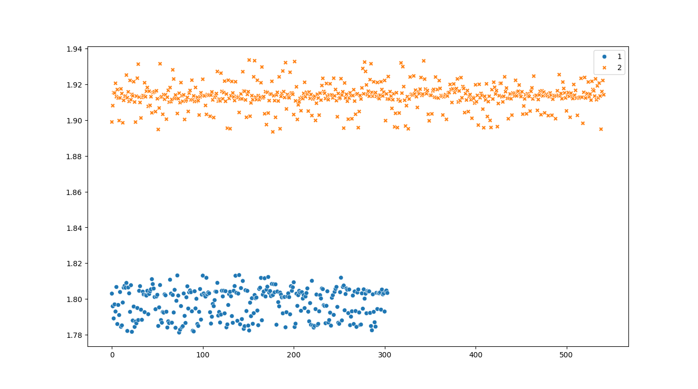

</div>

<span class="small">Example: `copy_1d`, `T=U8`, `BlockSize=64`, `ItemsPerThread=2`, `Elements=2^24`.</span>

---

# Confirm With Cycles

<!--Time can move because the GPU clock moved, not because the kernel changed.-->

When samples and frequencies are available, compare can check:

<div class="light-code">

```text
cycles = time * frequency
```

</div>

- raw timing intervals propose a decision;
- cycle-space evidence checks whether that decision survives clock changes;
- agreement strengthens FAST / SLOW / SAME;
- disagreement becomes AMBG.

---

# Log Distance Between Durations

<div class="light-code">

```text
D(t1, t2) = abs(log(t1) - log(t2)) = log(max(t1, t2) / min(t1, t2))
```

</div>

Advantages:

- symmetric: `D(cmp, ref) == D(ref, cmp)`;
- independent of timing units, `D(t1 * f, t2 * f) == D(t1, t2)`;
- comparable for microsecond and millisecond kernels;
- directly maps to relative tolerance.

---

# Relative Tolerance

In code we avoid `log`:

<div class="light-code">

```text
abs(log(cmp) - log(ref)) <= log(1 + delta)
max(ref, cmp) / min(ref, cmp) <= 1 + delta
```

```text
abs(ref - cmp) / min(ref, cmp) <= delta
```

</div>

Legacy compared absolute value of non-symmetric signed `(cmp - ref) / ref` against delta determined by noise.

---

# Decision Tree

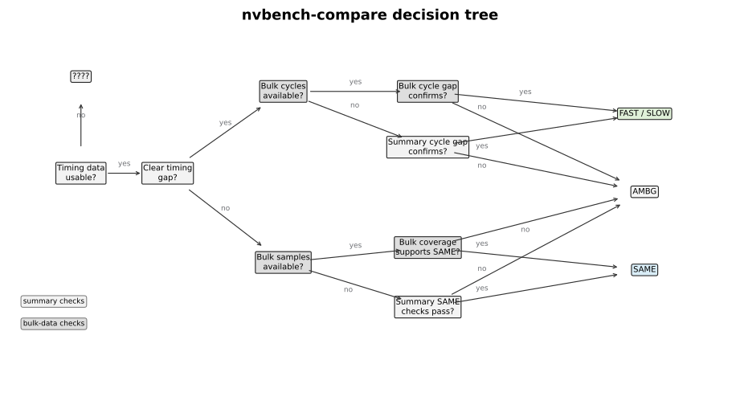

<span class="xsmall">In this diagram, “Bulk data” means paired timing and frequency samples. Timing-only saved data follows a SAME-only compatibility path.</span>

---

# Status Vocabulary

| Status | Meaning |
|---|---|
| 🔵 SAME | Evidence supports no meaningful performance change |
| 🟢 FAST | Compare run is clearly faster |
| 🔴 SLOW | Compare run is clearly slower |
| 🤷 AMBG | Ambiguous: could be same or changed |
| 🟡 ???? | Required timing data cannot be evaluated |

---

# Summary-Based Checks

The cheap path uses summary values:

- robust center/interval when available;
- mean/stdev fallback for legacy data;
- SM clock-rate average can provide cycle-style confirmation when bulk
  frequency samples are unavailable.

When timing samples are present, bulk coverage can confirm SAME, rescue
high-noise SAME, or keep the result AMBG when sample support disagrees.

---

# Clear Gap Criterion

The formula checks the closest interval endpoints:

<div class="formula-grid">

<pre><code>FAST if:
  cmp.upper < ref.lower
  and (ref.lower - cmp.upper) / cmp.upper
      >= clear_gap_relative

SLOW if:
  cmp.lower > ref.upper
  and (cmp.lower - ref.upper) / ref.upper
      >= clear_gap_relative</code></pre>

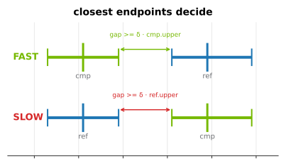

</div>

<!--
FAST if:
  cmp.upper < ref.lower
  and (ref.lower - cmp.upper) / cmp.upper >= clear_gap_relative

SLOW if:
  cmp.lower > ref.upper
  and (cmp.lower - ref.upper) / ref.upper >= clear_gap_relative
-->

This is log-distance-based, hence symmetric.

---

# Clear Gap Geometry

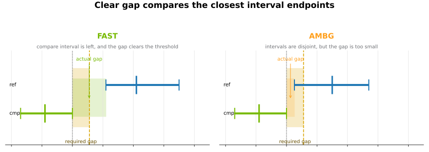

<!-- The SLOW case is symmetric: compare interval lies to the right of reference,
and the closest-endpoint gap clears the same relative threshold. -->

---

# Bulk Data Path

Bulk timing and frequency samples come from current `--jsonbin` output.
Older saved outputs may contain timing samples only.

When available, they allow:

- recomputing robust timing summaries;
- checking sample support directly;
- confirming SAME from timing coverage;
- confirming clear timing gaps in cycles when frequencies are available;
- debugging individual rows outside the report.

---

# Coverage Metric: Intuition


---

# Coverage Is Directional

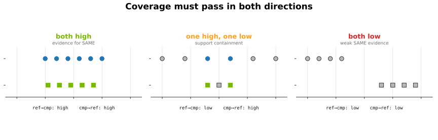

<div class="columns">
<div>

| ref→cmp | cmp→ref | Interpretation |
|---|---|---|
| high | high | evidence for SAME |
| low | high | compare covers only part of reference |
| high | low | reference covers only part of compare |
| low | low | weak SAME evidence; shifted data or tolerance too tight |

</div>

<div>

The decision requires sufficient coverage in both directions: `min(cov_ref, cov_cmp) >= threshold`.

</div>

</div>

---

# Two Coverage Questions

<div class="columns">

<div>

**Sample-weight coverage**

> Is most observed mass covered?

<span class="small">Repeated values matter more.</span>

**Unique-support coverage**

> Is the timing support covered?

<span class="small">Each distinct value matters once.</span>

</div>

<div>

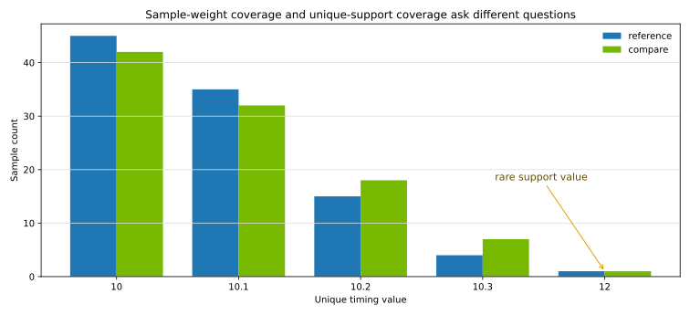

<div class="light-code small">

```text
sample_cov  = sum(sample_weight[x]  for covered x)
support_cov = sum(uniform_weight[x] for covered x)
```

</div>

<span class="xsmall">Both coverage flavors must meet threshold</span>

</div>

</div>

---

# Interpreting Default Output

`--display intervals` is the default:

<div class="report-table">

| T | Ref | Cmp | Change | Status |
|---|-----|-----|--------|--------|
| U8 | 19.944 [-0.564, +0.508] us | 18.736 [-0.336, +0.728] us | | 🔵 SAME |
| F32 | 52.190 [-0.477, +0.582] us | 47.714 [-0.538, +0.621] us | <= -8.6% | 🟢 FAST |
| F64 | 99.868 [-0.812, +0.951] us | 103.466 [-0.727, +0.903] us | >= +2.7% | 🔴 SLOW |
| I16 | 31.267 [-0.867, +0.509] us | 29.693 [-0.956, +0.956] us | | 🤷 AMBG |

</div>

Change appears only for FAST/SLOW and reports a conservative interval-derived bound (`<= -speedup`, `>= +slowdown`), not a center-to-center diff.

---

# Interpreting Summary Output

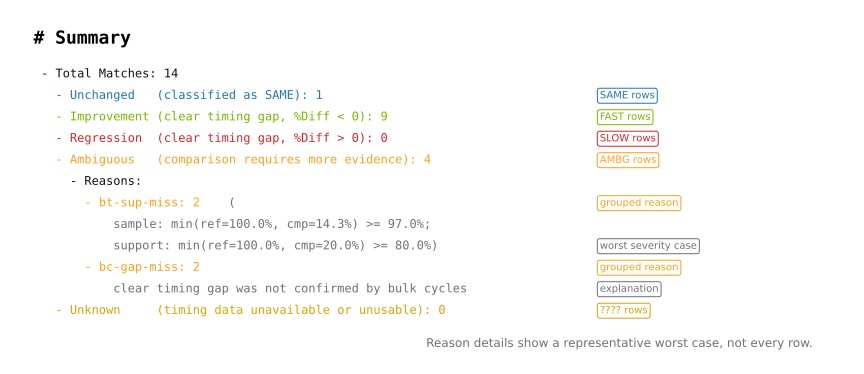

---

# Explain Mode

<div class="light-code">

```bash
nvbench-compare reference.json compare.json --display explain
```

</div>

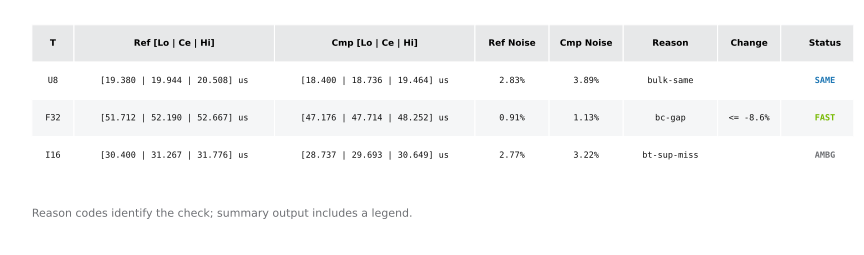

Use this when a row is AMBG or when you need to know which part of the decision
tree fired.

---

# Selecting Comparisons

<div class="columns">

<div>

**Device pairing**

<div class="light-code">

```bash
nvbench-compare \
  --reference-devices 0 \
  --compare-devices 1 \
  reference.json compare.json
```

</div>

- <span class="small">Filtered device lists must have the same length; devices are paired by position.</span>
- <span class="small">Permits comparing JSON files created with different # of devices used.</span>

</div>

<div>

**Benchmark / axis scoping**

<div class="light-code">

```bash
nvbench-compare \
  -b copy_type_sweep -a T=F32 \
  reference.json compare.json
```

</div>

- <span class="small">`-a` applies to the most recent `-b`, or to all selected benchmarks if it appears first.</span>
- <span class="small">Aligns with NVBench, was not supported by legacy `nvbench-compare` before.</span>

</div>

</div>

---

# Bulk Debug Workflow

Generate Python data loader for displayed rows:

<div class="light-code">

```bash
loader="$(mktemp "${TMPDIR:-/tmp}/nvbench-bulk-debug.XXXXXX.py")"
nvbench-compare reference.json compare.json --bulk-debug-python "$loader"
python -i "$loader"
```

</div>

The generated script contains filenames, axis values, status, reason, and helper
load functions for timing and frequency sidecar files.

---

# Configuration

The tool has many decision knobs, so TOML configuration is supported.

Common workflows:

<div class="light-code">

```bash
nvbench-compare reference.json compare.json --preset permissive
nvbench-compare --dump-config
nvbench-compare reference.json compare.json --config settings.toml
```

</div>

Presets are intended as starting points, not final calibrated policy.

---

# Legacy View vs. Legacy Comparator

`--display legacy` changes only the table shape.

| Command | Decision logic | Center / Noise |
|---|---|---|
| `nvbench-compare --display legacy` | new decision tree | selected timing family: robust if available, otherwise mean/stdev |
| `nvbench-compare-legacy` | old rule | mean and stdev/mean |

`Ref Noise` / `Cmp Noise` in `--display legacy` may differ from the benchmark's
printed `Noise` column or `nvbench-json-summary`.

---

# Legacy Compatibility

`nvbench-compare-legacy` keeps the mean/stdev decision rule available during
the transition.

It is useful when:

- validating that the new tool did not regress basic parsing behavior;
- comparing with historical workflows;
- giving users an escape hatch while thresholds are being calibrated.

---

# Demo Plan

1. Compare two clean reruns.
2. Show AMBG rows on a problematic dataset.
3. Switch to `--display explain`.
4. Generate `--bulk-debug-python`.
5. Inspect the row interactively.
6. Show collection settings: `--cold-warmup-runs`, `--cold-max-warmup-walltime`, `--jsonbin`.
7. Show a custom config or preset.

---

# Open Questions

- What thresholds should be default after calibration?
- Should plotting move to separate tools?
- Which diagnostics are too verbose for day-to-day use?
- Should a native nearest-neighbor implementation move into `cuda.bench`?

---

# Takeaways

- The new comparison path is evidence-driven.
- Summary data gives fast decisions when intervals clearly support them.
- Bulk data can rescue ambiguous cases.
- AMBG is a feature: it prevents overclaiming on weak evidence.

---

# Backup: Installation

<div class="light-code">

```bash
cd talk/nvbench-compare
npm install
python -m venv .venv
source .venv/bin/activate
python -m pip install -r requirements.txt
python scripts/generate_visuals.py
npm run slides:html
```

</div>

---

# Backup: Timing-Only Bulk Data

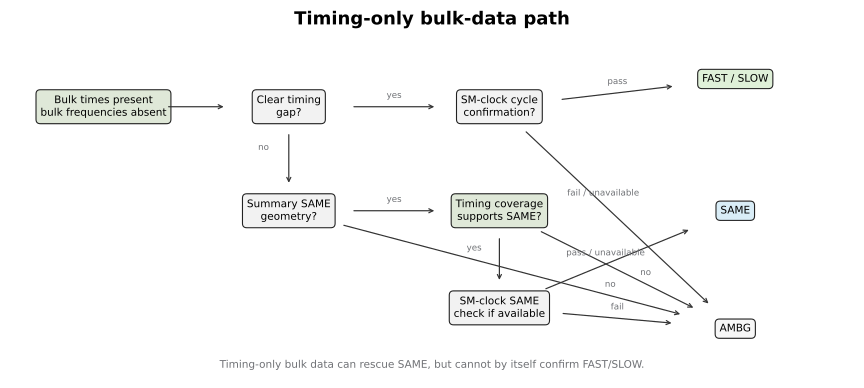

<span class="xsmall">This mainly matters for older saved `--jsonbin` outputs that have timing sidecars but no frequency sidecars.</span>

---

# Coverage Metric: Computation

For two timing samples:

1. Work on a relative scale using a tolerance such as `log(1 + epsilon)`.
2. For each reference value, find the nearest compare value.
3. Count it as covered if the distance is within tolerance.
4. Repeat in the reverse direction.
5. Track both sample-weight coverage and unique-support coverage.

The decision requires sufficient coverage in both directions.


---

# Reason Codes

Examples:

- `sum-same`: summary intervals support SAME;
- `bulk-same`: bulk timing and cycle coverage support SAME;
- `bt-same-sc`: timing coverage supports SAME, with summary-cycle confirmation;
- `bt-same-no-cyc`: timing coverage supports SAME, but cycle data are unavailable;
- `bc-gap`: bulk cycles confirm a FAST/SLOW gap;
- `bt-sup-miss`: bulk timing support coverage is too low;
- `int-miss`: summaries cannot produce timing intervals.
